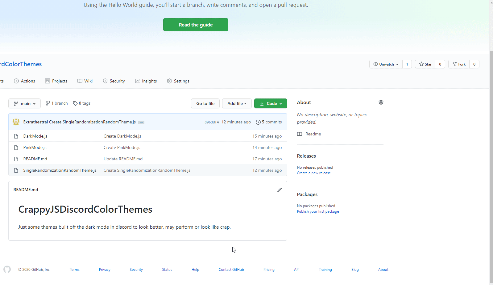

# Crappy JS Discord Color Themes

Just some themes built off the dark mode in discord to look better, may perform or look like crap.

To apply the theme, copy the text from inside the file of your choosing, make sure you have dark theme enabled in discord, then paste the code into the console, as shown by this gif.

# DarkTheme.js

Personal preference for what a dark mode should look like, I think it looks beautiful.

# PinkTheme.js

Request from a friend, intentionally horrendous

# SingleRandomizationRandomTheme.js

A color theme that chooses random colors for the theme and then applies it.
